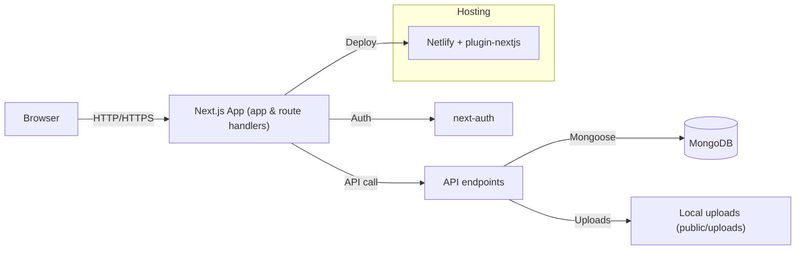
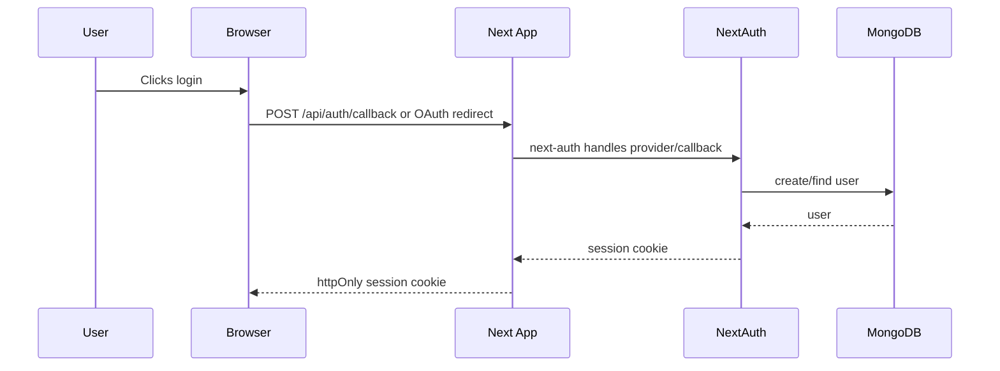

# ZenCampus

Smart campus management web application built with Next.js (App Router), TypeScript and Tailwind CSS. ZenCampus provides admin and student dashboards, canteen ordering, laundry management, maintenance, forums, notices, polls and more.

---

## Table of contents

- **Project**: Overview and features
- **Tech Stack**: Libraries and runtimes
- **Quick Start**: Install, run, build commands
- **Environment**: Required environment variables
- **Architecture**: Folder map and responsibilities
- **APIs & Models**: High-level API routes and data models
- **Development**: Coding, linting and type checks
- **Deployment**: Notes for Netlify / Vercel
- **Contributing**: Workflow and guidelines

---

## Project

ZenCampus is a full-featured campus management platform intended as a modular Next.js app combining server (Route Handlers) and client functionality. It targets accommodation and student-life workflows: canteen menus & orders, laundry bookings, maintenance requests, cleaning requests, notices, forum posts and polls, timetables, and admin management.

Key capabilities:

- Role-based areas for admins and students
- Canteen menu and ordering system
- Laundry bookings and machine status
- Maintenance / cleaning ticket flows
- Forum with posts & polls
- Notices, reports and basic statistics

---

## Tech stack

- Next.js (App Router) — pages, layouts and server components
```markdown
# ZenCampus

Smart campus management web application built with Next.js (App Router), TypeScript and Tailwind CSS. ZenCampus provides admin and student dashboards, canteen ordering, laundry management, maintenance, forums, notices, polls and more.

---

## Table of contents

- **Project**: Overview and features
- **Tech Stack**: Libraries and runtimes
- **Quick Start**: Install, run, build commands
- **Environment**: Required environment variables
- **Architecture**: Folder map and responsibilities + diagrams
- **APIs & Models**: High-level API routes and data models
- **Implementations**: Key patterns and where they live
- **Development**: Coding, linting and type checks
- **Deployment**: Notes for Netlify
- **Contributing**: Workflow and guidelines

---

## Project

ZenCampus is a full-featured campus management platform intended as a modular Next.js app combining server (Route Handlers) and client functionality. It targets accommodation and student-life workflows: canteen menus & orders, laundry bookings, maintenance requests, cleaning requests, notices, forum posts and polls, timetables, and admin management.

Key capabilities:

- Role-based areas for admins and students
- Canteen menu and ordering system
- Laundry bookings and machine status
- Maintenance / cleaning ticket flows
- Forum with posts & polls
- Notices, reports and basic statistics

---

## Tech stack

- Next.js (App Router) — pages, layouts and server components
- React 18, TypeScript
- Tailwind CSS for styling
- NextAuth for authentication
- Mongoose / MongoDB for persistence (see `lib/db.ts`)
- Multer for file uploads (`public/uploads`)
- Zod for validation, Winston for logging
- Other utilities: Lucide Icons, Framer Motion, Sonner (toasts), qrcode, bcryptjs

Node engine: `>=18.17.0` (see `package.json`)

---

## Quick start

1. Install dependencies

```bash
npm install
```

2. Create environment file `.env.local` (see Environment section)

3. Run in development

```bash
npm run dev
```

4. Build for production

```bash
npm run build
npm run start
```

5. Type check and lint

```bash
npm run type-check
npm run lint
```

---

## Environment variables

Create a `.env.local` in the project root with at least the following variables (names are conventional; verify usage in `lib/` and `api/` code):

- `MONGODB_URI` — MongoDB connection string used by `lib/db.ts`
- `NEXTAUTH_SECRET` — NextAuth secret for session encryption
- `NEXTAUTH_URL` — Base URL for NextAuth callbacks (e.g. `http://localhost:3000`)
- `EMAIL_HOST`, `EMAIL_PORT`, `EMAIL_USER`, `EMAIL_PASS` — (optional) SMTP for password reset or notifications
- `STORAGE_PATH` — Path for file uploads if you configure custom storage (default uses `public/uploads`)
- `NETLIFY` or platform-specific envs — when deploying to Netlify, set platform envs in the Netlify dashboard

Note: The code may reference additional variables; run a global search for `process.env.` to find any other required values.

---

## Architecture & folder map

Top-level layout (important files/folders):

- `app/` — Next.js App Router pages, layouts and templates. Contains area scaffolding: `(admin)`, `(dashboard)`, `(auth)` and route pages.
  - `globals.css` — global Tailwind CSS exports
- `api/` — Route Handlers (server code). Subfolders implement endpoints for `auth`, `canteen`, `laundry`, `maintenance`, `forum`, `timetable`, `students`, etc.
- `components/` — Reusable React components
  - `layout/` — structural components (sidebars, headers)
  - `ui/` — small UI primitives (Button, Input, Card, Modal, Badge)
- `hooks/` — Custom React hooks (`useApi.ts`, `useUser.ts`, `useSettings.ts`)
- `lib/` — Shared utilities and server helpers (`db.ts`, `auth-middleware.ts`, `settings.ts`, `utils.ts`, `validations.ts`)
- `models/` — TypeScript models representing domain entities (Canteen, LaundryBooking, User, etc.)
- `public/uploads/` — Uploaded assets (Multer destination by default)
- `types/` — Shared TypeScript types and NextAuth module augmentation (`next-auth.d.ts`)

Files of interest:

- `middleware.ts` — Global middleware for route protection
- `auth.ts` / `auth.config.ts` — Application-level auth helpers/configs
- `next.config.ts`, `netlify.toml` — project and deployment configuration

---

## Architecture diagrams

This section contains the architecture and authentication diagrams for the application.

### High-level request flow



### Authentication sequence (simplified)



---

## APIs & models (high level)

This document lists implemented Route Handlers found under `app/api/` (App Router). For full details, open each `route.ts` file.

> Note: HTTP methods (GET/POST/PUT/DELETE) are declared inside each `route.ts`. The descriptions below are inferred from file and folder names.

### Auth

- `/api/auth/[...nextauth]` — NextAuth configuration, providers and callbacks
- `/api/auth/me` — Current authenticated user info (session `me` endpoint)
- `/api/auth/forgot-password` — Password reset flow (email/OTP)

### Canteen

- `/api/canteen/menu` — Fetch canteen menu items
- `/api/canteen/menu/[id]` — Fetch menu item by id
- `/api/canteen/orders` — Create or list canteen orders
- `/api/canteen/orders/[id]` — Get/update specific order

### Laundry

- `/api/laundry` — Laundry booking endpoints (create/list)
- `/api/laundry/[id]` — Laundry booking by id
- `/api/laundry/check-status` — Check laundry booking or machine status
- `/api/machines` — List laundry machines and statuses
- `/api/machines/[id]` — Machine details and control/status

### Maintenance & Uploads

- `/api/maintenance` — Create/list maintenance tickets
- `/api/maintenance/[id]` — Maintenance ticket by id
- `/api/maintenance/upload` — Upload attachments for maintenance tickets

### Cleaning

- `/api/cleaning` — Create/list cleaning requests
- `/api/cleaning/[id]` — Cleaning request by id

### Forum

- `/api/forum/posts` — Create/list forum posts
- `/api/forum/posts/[id]` — Single forum post (get/update/delete)
- `/api/forum/polls` — Create/list polls
- `/api/forum/polls/[id]` — Poll by id

### Notices & Reports

- `/api/notices` — Create/list notices
- `/api/notices/[id]` — Notice by id
- `/api/reports` — Reports (generate/list)

### Students & Users

- `/api/students` — Student list and operations
- `/api/students/[id]` — Student by id
- `/api/users/[usn]` — User lookups by USN or identifier

### Timetable & Stats

- `/api/timetable` — Timetable CRUD
- `/api/timetable/[id]` — Timetable entry by id
- `/api/stats` — Basic statistics endpoints

### Settings

- `/api/settings` — Application settings read/write

### Misc

- Any additional endpoints are available under `app/api/*` — inspect the directory for module-specific handlers.

---

## Implementations & Patterns

- **DB connection caching**: `lib/db.ts` caches Mongoose connection across serverless invocations (important for Netlify / serverless envs).
- **Route handlers**: APIs implemented as Route Handlers under `api/*`, returning JSON and using `connectDB()` as needed.
- **Validation**: `zod` used across API layers for input validation.
- **Uploads**: `multer` is used server-side; uploaded files saved to `public/uploads` by default.
- **Role-based access**: `middleware.ts` and `lib/auth-middleware.ts` contain auth checks and redirect logic.

---

## Local development notes

- Run the app in dev mode: `npm run dev`.
- When editing server-side code (Route Handlers), restart the dev server if you encounter cached module issues.
- Use TypeScript type checking: `npm run type-check` and linting: `npm run lint`.

Debugging tips:

- Inspect server logs in the terminal running `next dev`.
- Add temporary logs in route handlers (avoid leaking secrets).

---

## Deployment

This project includes `@netlify/plugin-nextjs` and a `netlify.toml`, so it's prepared for deployment on Netlify. Alternately, it is compatible with Vercel.

Deployment checklist:

- Set production environment variables (`MONGODB_URI`, `NEXTAUTH_SECRET`, `NEXTAUTH_URL`, any SMTP and storage settings).
- Configure persistent storage for uploads if needed (S3 or similar) for multi-instance setups.
- For Netlify, ensure `@netlify/plugin-nextjs` is enabled and platform envs are configured in the Netlify dashboard.

---

## Contributing

1. Fork and create a feature branch: `git checkout -b feat/your-feature`
2. Implement changes and add tests where applicable
3. Run `npm run type-check` and `npm run lint`
4. Open a pull request with a clear description and screenshots for UI changes

Guidelines:

- Keep components small and composable; prefer primitives from `components/ui`.
- Keep data fetching centralised in hooks under `hooks/` or server Route Handlers.

---

## Troubleshooting

- Database connection errors: verify `MONGODB_URI` and network access
- Auth/session issues: ensure `NEXTAUTH_SECRET` and `NEXTAUTH_URL` match the runtime environment
- Upload issues: verify `public/uploads` exists and is writable; consider using cloud storage in production

---

## Where to look in the code

- App entry and global layout: `app/layout.tsx`, `app/globals.css`
- Auth & middleware: `api/auth`, `middleware.ts`, `lib/auth-middleware.ts`
- DB: `lib/db.ts`
- Models: `models/*` (entities)
- APIs: `api/*/route.ts`

---

```

