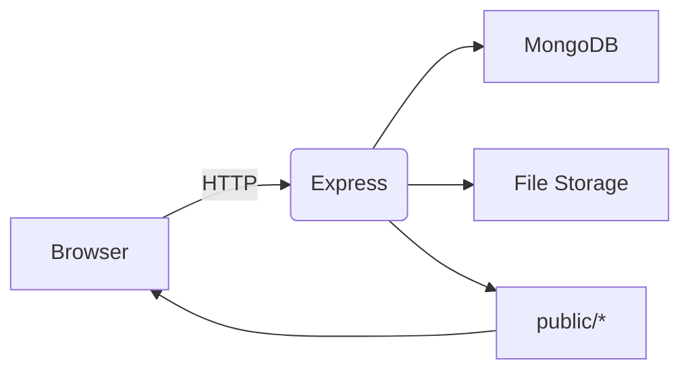
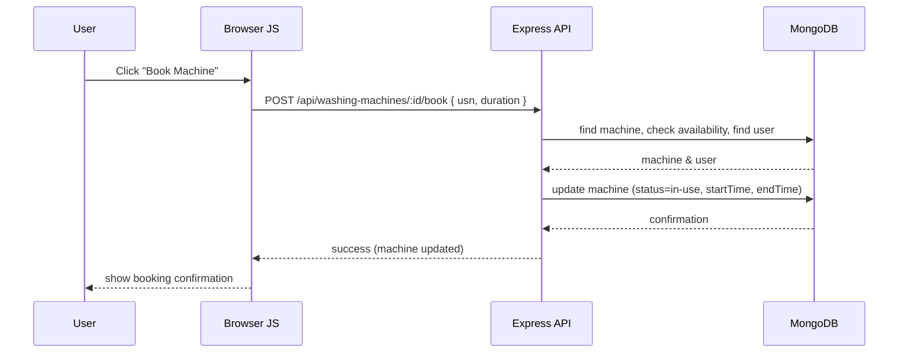
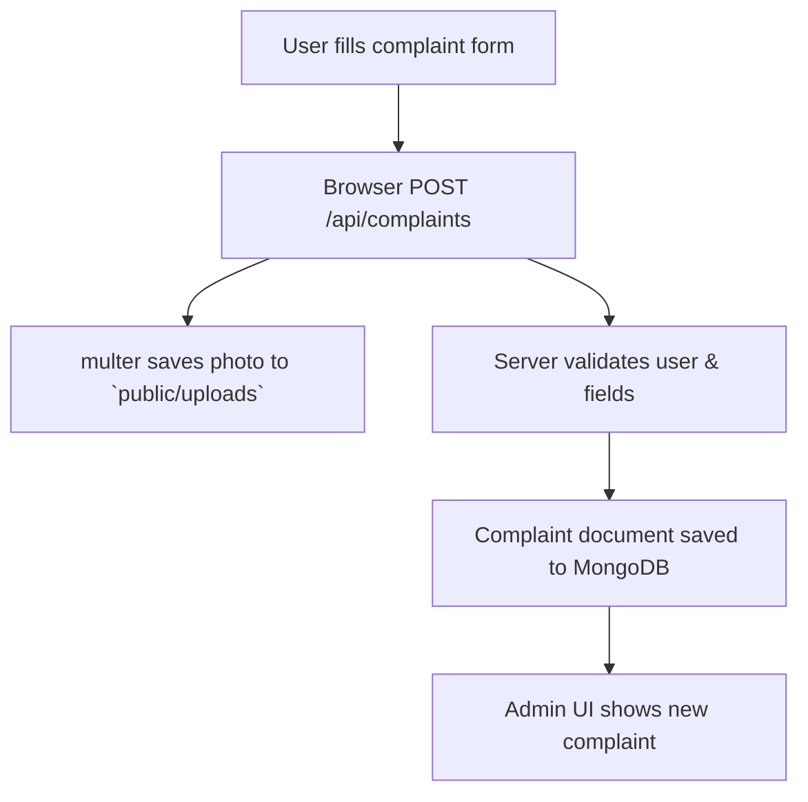

# ZenCampus

Overview
--------

ZenCampus is a lightweight campus management web app for handling student registration, washing/dryer machine bookings, and maintenance complaints.

**Tech Stack**
- **Backend:** `Node.js`, `Express`
- **Database:** `MongoDB` (via `mongoose`)
- **File uploads:** `multer`
- **Auth / Security:** `bcryptjs` for password hashing, `dotenv` for configuration
- **CORS/JSON bodies:** `cors`, `express.json()`
- **Dev tools:** `nodemon` (dev)
- **Frontend:** Static HTML/CSS/JavaScript in `public/`

**Project Structure**

```
.`
├── package.json
├── server.js
├── public/
│   ├── index.html
│   ├── admin.html
│   ├── dashboard.html
   ├── ... (other html files)
│   ├── css/
│   └── js/
└── uploads/ (runtime - user uploaded files)
```

**Modules / Major Files**
- `server.js`: Express server, route handlers, mongoose models (User, WashingMachine, DryerMachine, Complaint), upload handling, automated cleanup job.
- `package.json`: lists dependencies and `start`/`dev` scripts.
- `public/`: client-side UI (HTML/CSS/JS) and static assets.
- `public/uploads`: store uploaded complaint photos (created at runtime).

Diagrams
--------

Flowchart (High-level user action → server → DB)

```mermaid
flowchart TD
  A[User(Browser)] -->|requests pages/API| B[Express Server]
  B -->|serve static| C[public/*.html, css, js]
  B -->|REST API| D[API Handlers]
  D -->|read/write| E[(MongoDB via mongoose)]
  D -->|save files| F[public/uploads (multer)]
  E -->|data| B
```

Tech Diagram (Components)


```mermaid
graph LR
  Browser -->|HTTP| Server(Express)
  Server --> Mongo[MongoDB]
  Server --> Uploads[File Storage]
  Server --> Static[public/*]
  Static --> Browser
```

Logic Diagram (Booking flow simplified)


```mermaid
sequenceDiagram
  participant U as User
  participant B as Browser JS
  participant S as Express API
  participant DB as MongoDB

  U->>B: Click "Book Machine"
  B->>S: POST /api/washing-machines/:id/book { usn, duration }
  S->>DB: find machine, check availability, find user
  DB-->>S: machine & user
  S->>DB: update machine (status=in-use, startTime, endTime)
  DB-->>S: confirmation
  S-->>B: success (machine updated)
  B-->>U: show booking confirmation
```

Steps Diagram (How a complaint is created)


```mermaid
flowchart TD
  A[User fills complaint form] --> B[Browser POST /api/complaints]
  B --> C[multer saves photo to `public/uploads`]
  B --> D[Server validates user & fields]
  D --> E[Complaint document saved to MongoDB]
  E --> F[Admin UI shows new complaint]
```

How to Run (locally)
---------------------

Prerequisites
- Node.js (v16+ recommended)
- MongoDB running locally or URI in `.env`

1. Install dependencies

```bash
cd /Users/rounak/Documents/Project/ZenCampus
npm install
```

2. Create `.env` (optional)

Create a `.env` file in the project root to override defaults (optional):

```bash
PORT=3000
MONGODB_URI=mongodb://localhost:27017/zencampus
ADMIN_ID=admin
ADMIN_PASS=admin123
```

3. Start server

```bash
# Development (auto-restart on changes)
npm run dev

# Production / normal
npm start
```

4. Open in browser

Visit `http://localhost:3000` (or `http://localhost:<PORT>` if changed).

Notes & Tips
------------
- The server serves static files from `public/` so client-side routing is served directly.
- Uploaded images are saved to `public/uploads` (created at runtime).
- API endpoints are under `/api/*` — see `server.js` for full list.
- Use `npm run dev` while developing (requires `nodemon`).

---

